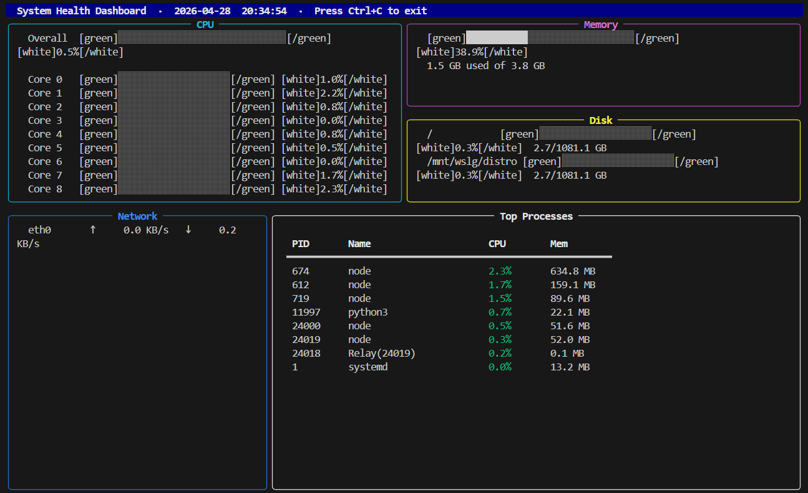

# System Health Dashboard 

A lightweight, real-time terminal dashboard that reads raw hardware data directly from the Linux `/proc` virtual filesystem. 

Built with **Bash** and **Python**, this project bypasses heavy, pre-packaged system monitoring tools (like `htop` or `top`) to extract and calculate system metrics from scratch.

 *

##  Features
* **Live CPU Tracking:** Monitors overall CPU load and individual core usage.
* **Memory Status:** Calculates total, used, and available RAM.
* **Disk I/O & Storage:** Tracks partition mount points and storage limits.
* **Network Speeds:** Live tracking of upload (TX) and download (RX) speeds.
* **Process Management:** Identifies the top running processes consuming the most CPU and Memory.
* **Rich Terminal UI:** A clean, color-coded interface built with Python's `rich` library.

##  Under the Hood
This project is built in two phases to demonstrate how Linux handles hardware states:
1. **The Bash Script (`sysinfo.sh`):** A standalone script that uses `awk` and basic math to parse kernel files directly (e.g., `/proc/stat`, `/proc/meminfo`, `/proc/net/dev`).
2. **The Python Dashboard (`dashboard.py`):** A live-updating UI that wraps the kernel data into a beautiful, readable terminal panel using `psutil` and `rich`.

---

##  Installation & Setup

### Prerequisites
* A Linux environment (Ubuntu, Debian, or WSL)
* Python 3.x

### 1. Clone the repository
```bash
git clone [https://github.com/EisaShaiju/system-dashboard.git](https://github.com/EisaShaiju/system-dashboard.git)
cd system-dashboard